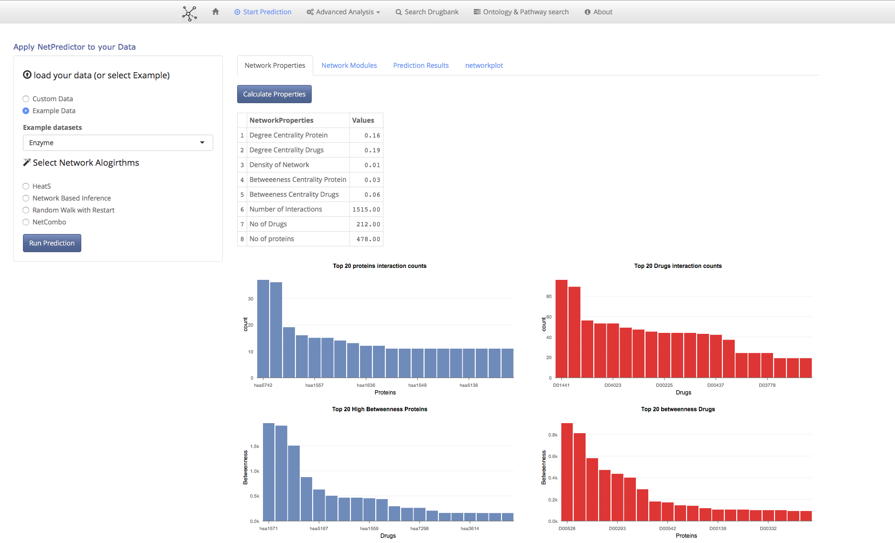
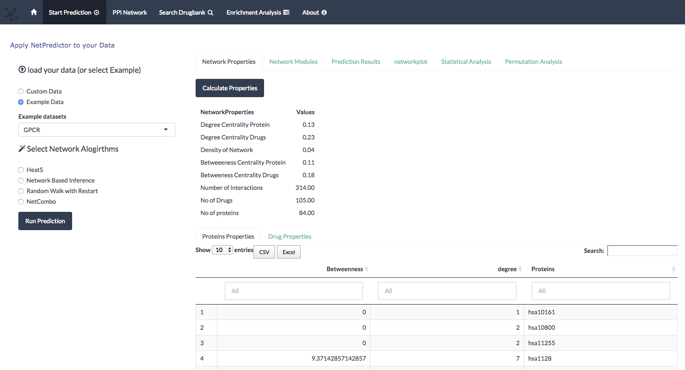
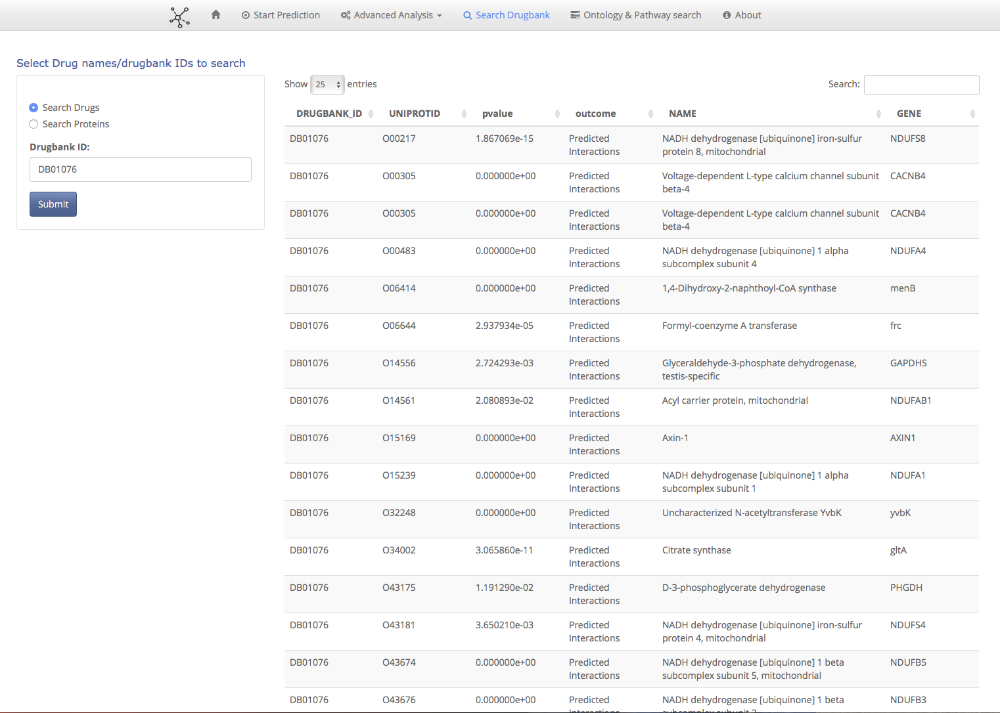
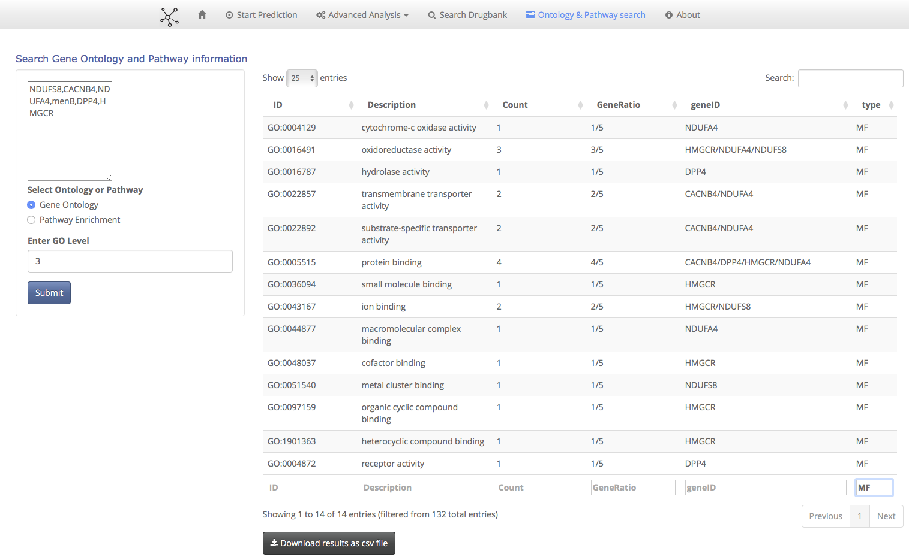

<!--- 
  NOTE: this file is modified by running `redocument`, via `README.Rmd`
  only the Version line is modified.
 -->

# NetPredictor: Analyzing and Predicting Links in Bipartite Network data

* **Version:** 1.0.1
* 
* 
* **Source:** [GitHub](https://github.com/abhik1368/Shiny_NetPredictor)
* **Problems:** [Bug reports and feature reqests](https://github.com/abhik1368/netpredicter/issues)
* **Authors:** [Abhik Seal](https://www.linkedin.com/in/abseal)

To use the package and explore the PPI Interaction first download the PPI data from [Figshare](https://figshare.com/articles/Interactome_data/5572774) unzip and dump them into the data folder of the application.

This will not install RRO package in your machine . For fast computations install RRO package from [MRAN](https://mran.revolutionanalytics.com/download/#download)

### Images of the App

### Acknowledgements

This project's rapid creation would not have been possible without
the numerous excellent R packages available to us.  We wish to
acknowledge these and thank the authors for their work:

* [shiny](http://cran.r-project.org/web/packages/shiny/index.html), [markdown](http://cran.r-project.org/web/packages/markdown/index.html), and 
* [RRO Open](https://mran.revolutionanalytics.com/open/),[Netpredictor](https://github.com/abhik1368/netpredicter),[igraph](https://cran.r-project.org/web/packages/igraph/index.html)
* Some amazing cool shiny packages like [shinysky](https://github.com/AnalytixWare/ShinySky),[shinyBS](https://github.com/ebailey78/shinyBS),[shinythemes](https://github.com/rstudio/shinythemes)
* Some bioconductor packages for Ontology and Pathway search
[clusterProfiler](http://bioconductor.org/packages/release/bioc/html/clusterProfiler.html),[ReactomePA](http://bioconductor.org/packages/release/bioc/html/ReactomePA.html),[biomaRt](http://bioconductor.org/packages/release/bioc/html/biomaRt.html)
* Some important R packages such as
[igraph](http://igraph.org/r/),[DBI](https://cran.r-project.org/web/packages/DBI/index.html),[RSQLite](https://cran.r-project.org/web/packages/RSQLite/index.html),[data.table](https://cran.r-project.org/web/packages/data.table/index.html)
* Some javascript packages such as [visNetwork](http://dataknowledge.github.io/visNetwork/),[rCharts](http://rcharts.io/),[data.tables](https://cran.r-project.org/web/packages/data.table/index.html)

